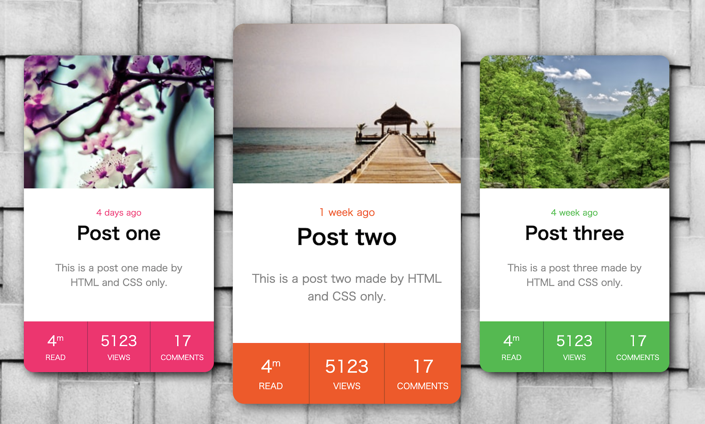
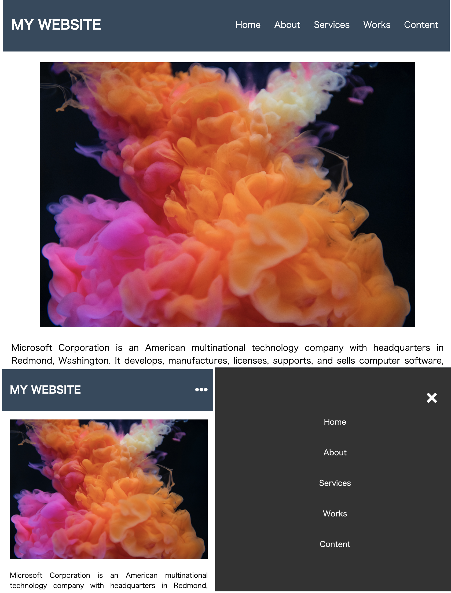

# css-collection

## Reference

### 01 - RPG Styles Card with Hover Effect

[YouTube: RPG Styles Card with Hover Effect - HTML/CSS](https://www.youtube.com/watch?v=cwC1qdPWBKo)  
[RPG Style Card Design with Hover Effect – HTML/CSS Tutorial](https://redstapler.co/rpg-style-card-design-with-hover-effect-html-css-tutorial/)

#### Image

#### MDN web docs

[justify-content](https://developer.mozilla.org/en-US/docs/Web/CSS/justify-content)  
[align-items](https://developer.mozilla.org/en-US/docs/Web/CSS/align-items)  
[overflow](https://developer.mozilla.org/en-US/docs/Web/CSS/overflow)  
[grid-template-columns](https://developer.mozilla.org/en-US/docs/Web/CSS/grid-template-columns)  
[grid-template-rows](https://developer.mozilla.org/en-US/docs/Web/CSS/grid-template-rows)  
[grid-template-areas](https://developer.mozilla.org/en-US/docs/Web/CSS/grid-template-areas)  
[transition](https://developer.mozilla.org/en-US/docs/Web/CSS/transition)

#### Pictures

https://source.unsplash.com/collection/3/300x300  
https://source.unsplash.com/collection/8/300x300  
https://source.unsplash.com/collection/9image2/300x300

### 2 - Responsive Menu Navigation Using Only HTML & CSS

[Youtube: Responsive Menu Navigation Using Only HTML & CSS](https://www.youtube.com/watch?v=cQ6YQ8K5MRw)  
[Font Awesome](https://fontawesome.com/)  
[Flat UI Colors](https://flatuicolors.com/)

#### Image

#### MDN web docs

[line-height](https://developer.mozilla.org/en-US/docs/Web/CSS/line-height)
